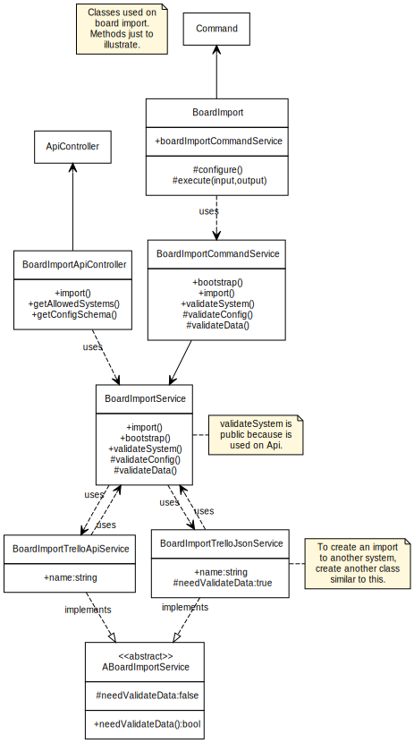

## Import class diagram

Importing boards to the Deck implements the class diagram below.

> **NOTE**: When making any changes to the structure of the classes or implementing import from other sources, edit the `BoardImport.yuml` file

