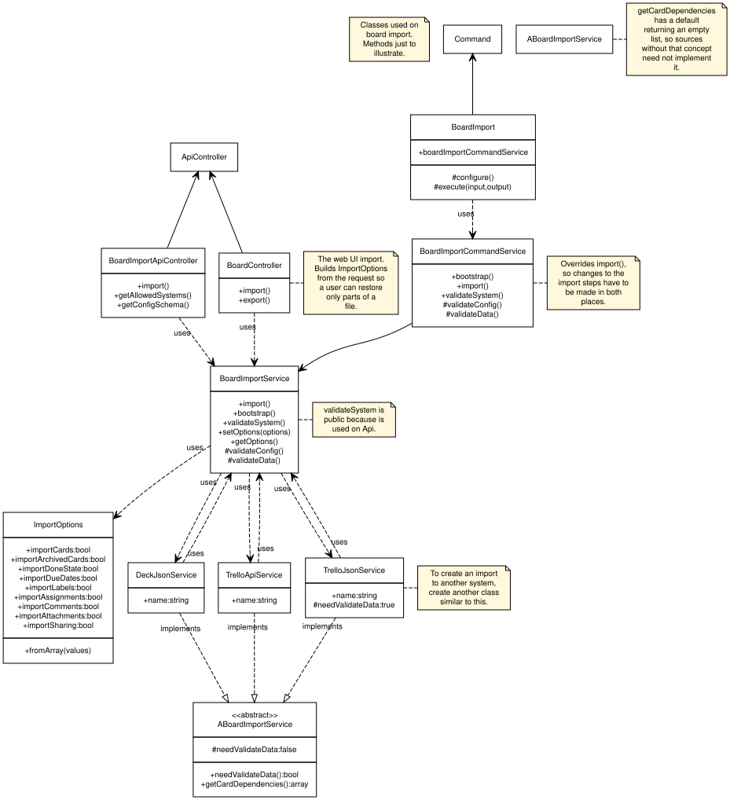

<!--
  - SPDX-FileCopyrightText: 2021 Nextcloud GmbH and Nextcloud contributors
  - SPDX-License-Identifier: AGPL-3.0-or-later
-->
## Import class diagram

Importing boards to the Deck implements the class diagram below.

> **NOTE**: When making any changes to the structure of the classes or implementing import from other sources, edit the `BoardImport.yuml` file and regenerate `BoardImport.svg` from it with the [yUML extension](https://github.com/jaime-olivares/vscode-yuml).

